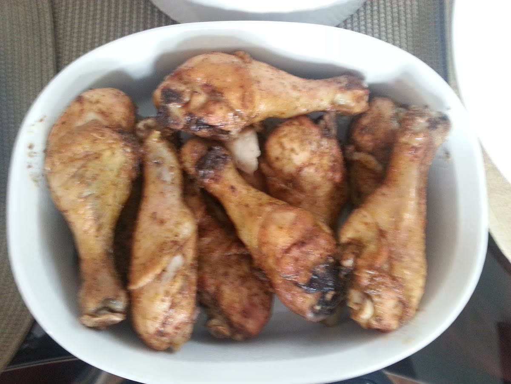
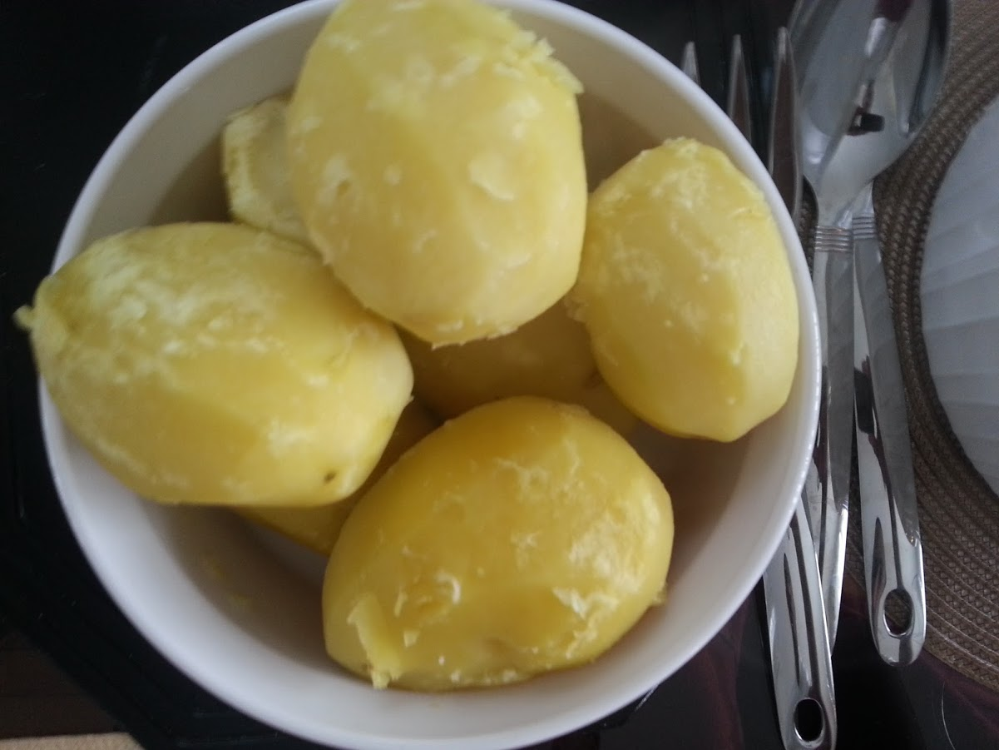
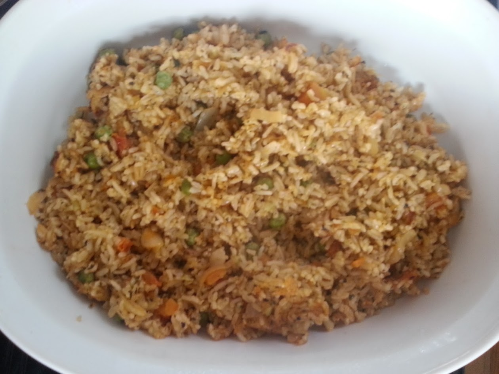
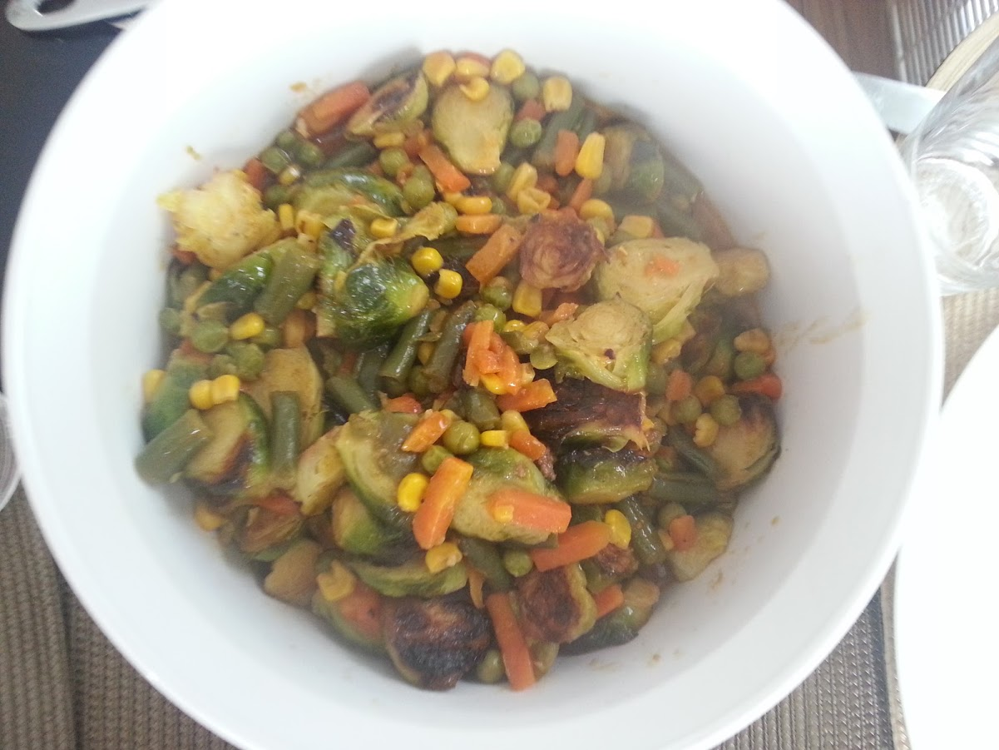
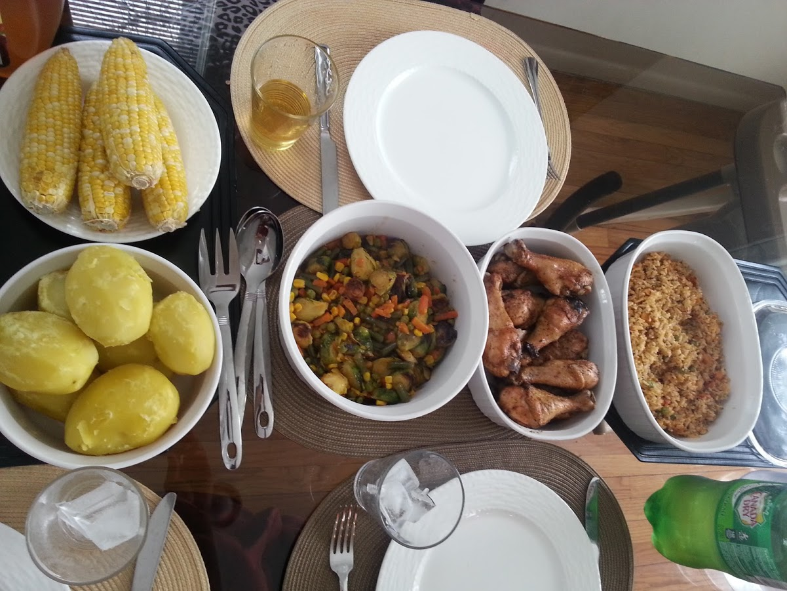
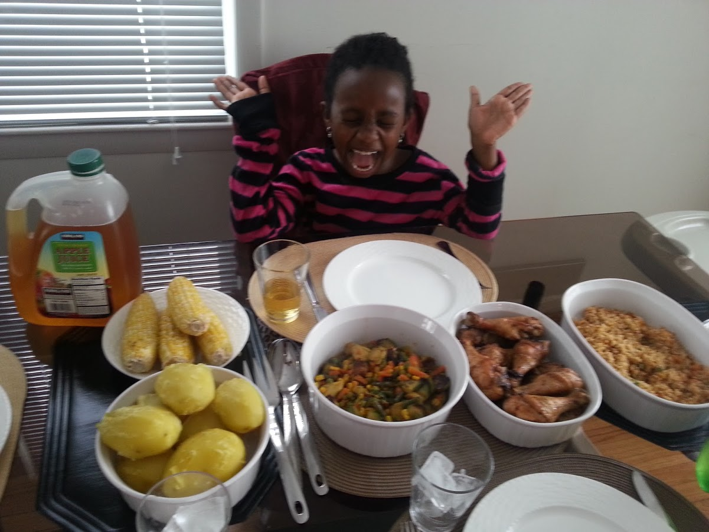

Drumstastic (Full Meal)
=======================

This recipe is for a complete meal and not just a single dish. That said, you can follow any of the instructions on their own to prepare whichever dish you'd like.

The driving force behind this particular culinary excursion was simply that I had a surplus of drumsticks from Costco (they pack in way too many in those things in a single purchase) and also needed to satisfy a non-beef eater in the house for a day or so.

# Ingredients
- 10-12 Chicken drum sticks
- 1 pack of mixed vegetables
- Seasonings: Old Bay, Accent, garlic (powder's fine), black pepper 

# Supplementals
- 4-6 ears of corn on the cob
- 1 pack (10oz) seasoned brussels sprouts
- 6 or so potatoes
- 1 or 2 bags of brown rice

# Instructions

## Chicken
1. Clean your drumsticks if necessary
2. Pre-heat your oven for 380 deg
3. Using a pan, add all of your seasonings and chicken together and mix with your hands
4. Once your oven's preheated, add a tablespoon or so of olive oil to your oven-safe dish and lay out the drumsticks in any configuration you prefer and toss in the oven. Set your timer for 45 minutes.

### Chicken (completed)

## Potatoes
1. Peel your potatoes and slice each in half if large enough
2. Place your potatoes in a large pot with enough cold water to cover all of your sliced potatoes
3. Add about 1 tablespoon of salt to the pot and let boil for 25 minutes

### Potatoes (completed)

## Rice
1. Add rice to a pan with about 1 tablespoon of olive oil.
2. Cook for 8-10 minutes while occasionally stirring to prevent the rice from burning or sticking to the pan.

### Rice (completed)

## Mixed Vegetables with Thai Curry Sauce
At this point, your chicken's baking and your potatoes are boiling. We give the mixed veggies some attention.

1. In a large frying pan, heat 2 tablespoons of olive oil for about a minute.
2. Add your mixed vegetables and stir occasionally for about 5 minutes.
3. In a separate frying pan, heat 2 tablespoon of olive oil and stir fry the brussel sprouts, adding in some Accent, Old Bay and Black Pepper for seasoning. Stir fry for about 8 minutes.
4. Add your Thai Curry Sauce to the pan with the mixed vegetables, reduce your heat to a lower setting. 
5. Add brussel sprouts to mixed veggie pan.
6. Let pan simmer for 10-12 minutes.

### Mixed Vegetables (completed)

## Serving
The chicken should be just about done at the time the mixed veggie + brussel sprouts pan has simmered for about 10-12 minutes. You can now take them out of the oven.

### This meal should feed 4-6 people.

### I think my daughter, Alexie, approves!

## Enjoy!