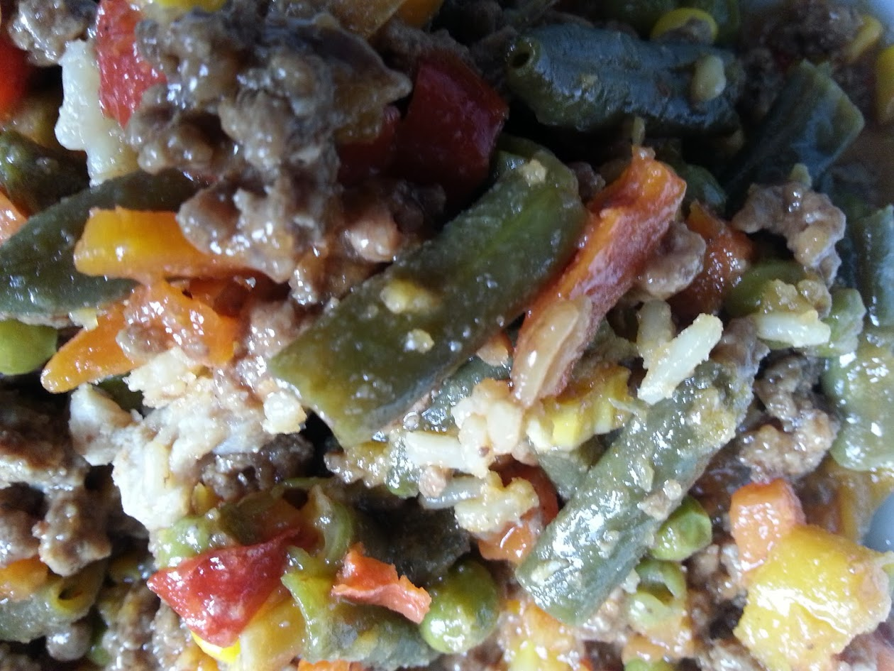

Meat-Tsao Vegetable Medley
=========================

As with many of my dishes, the birth of the Meat-Tsao Vegetable Medley came as a result of looking in the freezer for what was available. I lucked out with some ground beef and a bag of mixed vegetables. I also had a bottle of General Tsao Stir Fry Sauce that I picked up from Trader Joe's a week earlier so I thought this was a nice opportunity to try it with a meal.

A few minutes and steps yielded a nicely flavored meat dish that my kids not only loved because of it's sweetness but that even my wife thought was high-end restaurant quality. Not bad for an improvised meal.

# Ingredients

- 1.5 to 2 Lbs of Ground Beef
- 1 Trader Ming's General Tsao Stir Fry Sauce
- 1 Pack of Mixed Vegetables
- 1 Onion
- 1 Green, 1 red and 1 orange bell peppers
- 3 tablespoons of vegetable oil

# Instructions
1. Dice the onions and peppers
2. Spice the ground beef with garlic powder, old bay seasoning and  ground black pepper
3. Heat large frying pan with oil
4. Add diced onions, peppers and mixed vegetables to pan, stir fry for about 1 minute
5. Add ground beef to pan, mix and let cook for 5 minutes or until all the ground beef has cooked through
6. Reduce temperature to a low setting, add the General Tsao Fry Sauce and let simmer for 5 to 8 minutes while stirring occasionally
7. Serve over brown rice or potatoes for example
